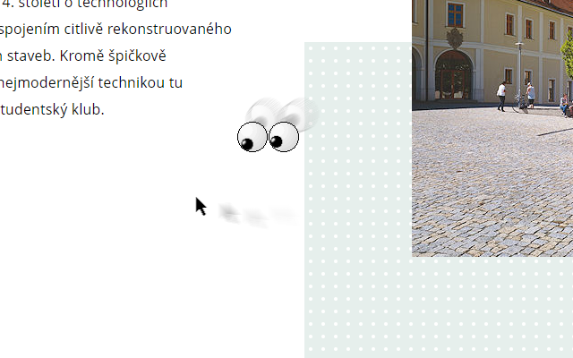

# VUT FIT Googly Eyes

Jednoduché rozšíření, které přidá na stránky fakulty FIT legendární oči sledující pohyb myši. 

V nastavení rozšíření je možné zvolit, na které stránky budou oči přidány. Ve výchozím nastavení se zobrazují ve WISu a stránkách studijního poradce. Oči je možno dále zobrazit na stránkách studentů nebo na celém webu FITu.

### [Dostupné v Chrome Store](https://chrome.google.com/webstore/detail/vut-fit-googly-eyes/gkcblnbnfobkkkkglmlammegbmpfkfie)

#### Ukázka funkčnosti rozšíření

